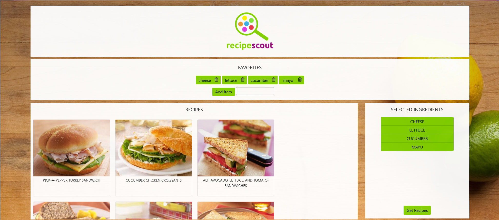

# RecipeScout Recipe Finder

**Author:** Maki Canedo Aranas

## Description

- This app helps you find recipes that use ingredients you have on hand. RecipeScout keeps track of items you typically have in stock. New items may be added to your staples list, or if you find you no longer use a particular item, remove it from your staples list.

## Instructions

- When you open the app, you are greeted with a modal that displays the items in your staples list. You may add new staples and the item and an image (if it is available) will be added to the list.
- Select the staples that you want to use for the meal you are planning.
- Press search recipes, and RecipeScout will access the Spoonacular API to find recipes that use the selected items. These recipes are displayed on the main screen.
- To view the instructions for a particular recipe, click on the recipe image.

## Deployed Link

<<<<<<< HEAD
Recipe Scout(https://makimardz.github.io/WDD330_RecipeScout/)
=======
RecipeScout
>>>>>>> 1fb4941a70d2a6bf0bdd7343efe432abcc169aaa

## Screenshot

## Technologies

* JavaScript
* JQuery
* Bootstrap
* HTML
* CSS
